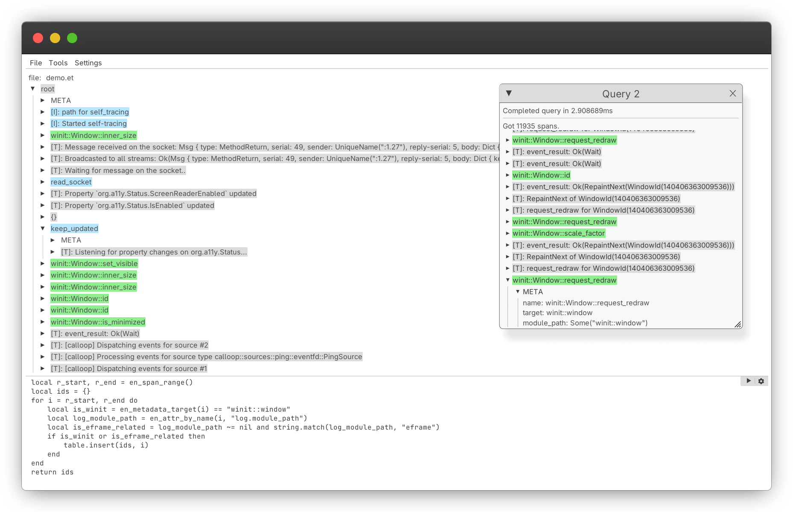

# ENTRACE

ENTRACE is a modern **log viewer and observability toolkit for Rust** built on the excellent [tracing](https://crates.io/crates/tracing) crate.

It facilitates better viewing, exploring, and storage of **structured logs** for small-to-medium sized applications, where other solutions (OpenTelemetry, Grafana/Loki, ...) are overkill.

The ENTRACE toolkit consists of:

  - **file formats** for storage of the structured data associated with traces
  - a **client library** that provides writers and readers for the file formats, conversion between them, and remote tracing over TCP
  - a **hierarchical, GUI log viewer** built with [egui](https://github.com/emilk/egui)
  - a **Lua API** for querying span information, which is used for performing queries on structured data in the GUI
  - a **formatter** for the [tracing_subscriber](https://crates.io/crates/tracing) crate, which formats events printed to the console in a less verbose manner.

ENTRACE is provided at no cost and without warranty.

## Name
- The name ENTRACE may be interpreted as the word *trace* with the prefix *en-*, meaning to write or materialize some information, similarly to *engrave*.
- A second interpretation may be a misspelling of *entrance*, as ENTRACE is your entrance to tracing.

## Motivation
The `tracing` crate provides advanced features for tracing that go beyond simple logging, such as span attributes or nested traces.

However, the projects using `tracing` generally fall into one of these two categories:

  - simple projects using tracing macros and `tracing_subscriber` as a replacement for `eprintln!`, for non-structured logging.
  - advanced projects using `tracing` to write data to enterprise level log stores, like Grafana, OpenTelemetry backends, or proprietary log silos.

We believe that this split is primarily induced by inadequate tooling to work with structured traces on a medium scale. 

Our aim is to fill this gap in tooling, to make structured tracing available to the masses.

## File formats
ENTRACE provides two file formats: `et`, and `iet`.

These are mostly the same, with one key difference: `et` cannot be appended, but is friendly to memory mapping, as it contains extra headers at the start of the file to facilitate fast navigation.
- **Choose `et`** for scenarios which involve writing a lot of tracing data, once, and reading it afterwards 
- **Choose `iet`** for scenarios which involve write data continously, (for example, a web server).
- The two file formats are **cheap to convert**, so there is no need to over-think this decision. 

In addition, ENTRACE allows **remote tracing over TCP**.

For more information, see [file-formats.md](./docs/file-formats.md)

## Usage
### As a library
`entrace_core` provides a plug-and-play layer for `tracing_subscriber`.
Short example:

```rust
use entrace_core::{layer::TreeLayer, mmap::IETStorage};
use std::sync::Arc;
use tracing::{info, level_filters::LevelFilter};
use tracing_subscriber::{Registry, layer::SubscriberExt, util::SubscriberInitExt};

fn main() {
    let file = OpenOptions::new()
        .write(true)
        .create(true)
        .open("my_program.iet")
        .unwrap();
    let storage = Arc::new(IETStorage::init(file));
    let tree_layer = TreeLayer::from_storage(storage.clone());
    Registry::default()
        .with(LevelFilter::TRACE)
        .with(tree_layer)
        .init();
    info!(target = "World", "Hello");

    // ...

    // save the trace when you shut down the process
    storage.finish();
}
```

For more information, consult the [entrace_core docs](./docs/usage-library.md).

### Using the GUI
Consult [usage-gui.md](./docs/usage-gui.md)

## Installation
### With cargo
Assuming that `pwd` is the repo root:
```
$ cd gui/
$ cargo install --path .
```
### With nix
```
$ nix build
```

Or alternatively,
```
$ nix run github:algorithmiker/entrace
```

## Performance
ENTRACE was designed with performance in mind, but did not receive much manual optimization yet.

- The `entrace_core` library should not slow your program down by any noticable amount in reasonable scenarios.
By non-scientific experimentation, writing entrace traces is much faster than using `tracing_subscriber`'s JSON output with span tracking enabled, and a file appender, as the file format is more compact and less redundant.
- The GUI should be reasonably performant too. When simply viewing traces, it is not uncommon to encounter sub-100-us frame times (10 000+ FPS); although it is possible to construct traces and queries on which the various lazy renderers struggle.

## Maintenance
### Supported platforms
The `entrace_core` library will work on any platform supported by the Rust standard library.

The **GUI is primarily supported on Linux** based targets. It supports Windows and MacOS too in theory, but the user experience might be degraded (for example, the GUI assumes threads are very cheap to spawn, which is not true on Windows).

### Releases and stability
ENTRACE is complete in the sense that there is a basic set of features that work well together, and the file format is mostly stable.
However, we consider the current version of ENTRACE a **public beta**, which is signified by the version number starting with 0.

Until ENTRACE is stabilized (version number >= `1.0.0`), **breaking changes may occur**.
Depending on public interest (usage) of ENTRACE, **migration guides or scripts** may be provided.

You may open a feature request, but please note that ENTRACE is provided on a voluntary basis, and your feature request might be rejected.

## License

Licensed under either of

 * Apache License, Version 2.0
   ([LICENSE-APACHE](LICENSE-APACHE) or <http://www.apache.org/licenses/LICENSE-2.0>)
 * MIT license
   ([LICENSE-MIT](LICENSE-MIT) or <http://opensource.org/licenses/MIT>)

at your option.

## Contribution

Unless you explicitly state otherwise, any contribution intentionally submitted
for inclusion in the work by you, as defined in the Apache-2.0 license, shall be
dual licensed as above, without any additional terms or conditions.
